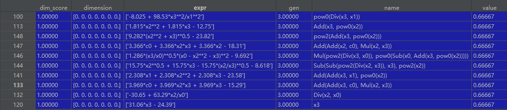

Top n best
================

This is a sample checking the best n results in target generation.

Note:
    Only valid in ``store=True``.

::

    if __name__ == "__main__":
        from sklearn.datasets import load_iris
        from bgp.skflow import SymbolLearning
        from sklearn import metrics
        from sklearn.utils import shuffle

        data = load_iris()
        x = data["data"]
        y = data["target"]
        c = [1, 2, 3]

        sl = SymbolLearning(loop="MultiMutateLoop", pop=50,
                            re_hall=3,
                            gen=3, random_state=1,
                            classification=True,
                            scoring=[metrics.accuracy_score, ], score_pen=[1, ],
                            store=True,
                            )

        sl.fit(x, y, c=c)
        score = sl.score(x, y, "r2")
        top_n = sl.loop.top_n(10)
        print(sl.expr)

where the top n is a table (Pandas.DataFrame object), as following:

