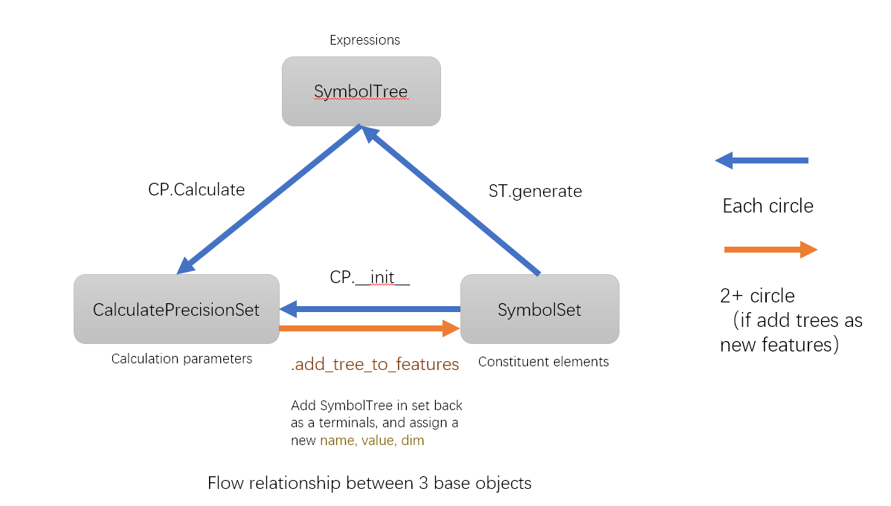
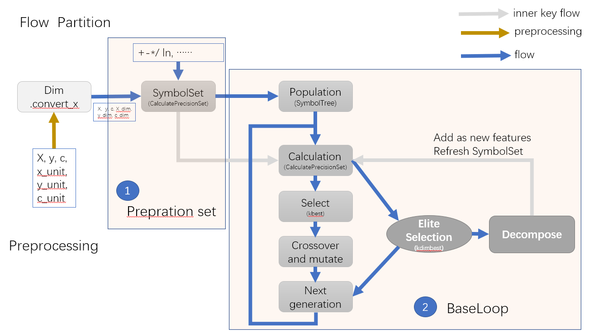
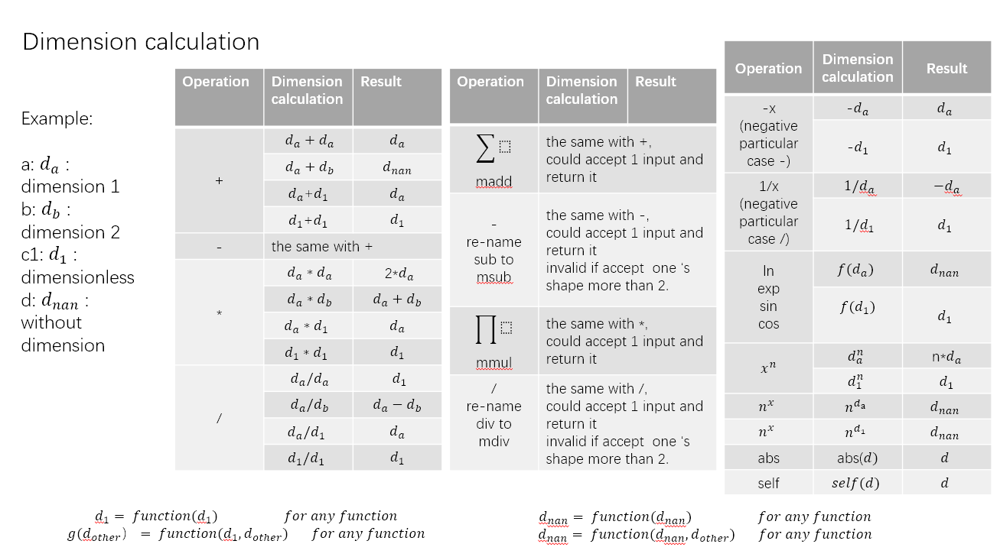

Guide
===================

.. toctree::
   :hidden:
   :maxdepth: 3
   :caption: Contents:

   skflow
   remarks
   base
   flow

**Suggested Using**

``skflow``: One sklearn-type implement to run symbol learning

**Advanced Using**

``base``:  The storage form of expression (tree-style), integration calculate methods, and define the present set for features and operations

``flow``:  Genetic algorithm loop

**For developers**

``preprocess``:  One "sklearn-type" implement to transform X

``gp``:  Genetic algorithm method

``function``:  Operation roles, Vector Operation, Dimension Operation, To define Operation

``calculation``:  Expression tree translation, Coefficient addition, Score

This API is aimed for user but not developer. Therefore some modules are just with brief introduction.
If you want to know more math principles and code structure,

Turn to `Developer Manual.pdf <https://github.com/boliqq07/BGP/tree/master/docs/doc.pdf)>`_.

where you can see:

